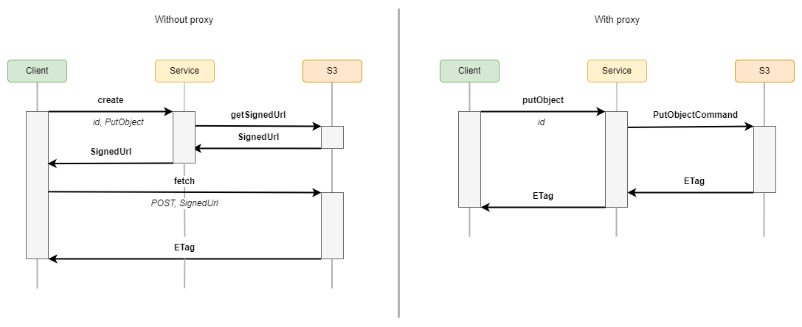
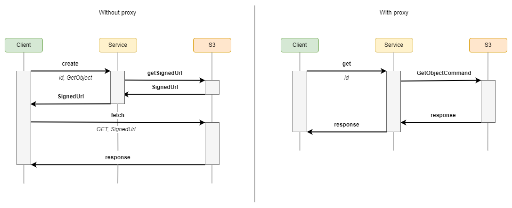

# feathers-s3

[](https://github.com/kalisio/feathers-s3/releases)
[](https://app.travis-ci.com/kalisio/feathers-s3)
[](https://codeclimate.com/github/kalisio/feathers-s3)
[](https://codeclimate.com/github/kalisio/feathers-s3/coverage)
[](https://www.npmjs.com/package/@kalisio/feathers-s3)

> `feathers-s3` allows to deal with [AWS S3 API](https://docs.aws.amazon.com/AmazonS3/latest/API/Welcome.html) compatble storages.

Unlike the solution [feathers-blob](https://github.com/feathersjs-ecosystem/feathers-blob) which provides a store abstraction, `feathers-s3` is limited to
be used with the stores that provide an S3 compatible API. However, it takes advantage of the **S3 API** by using [presigned URLs](https://docs.aws.amazon.com/AmazonS3/latest/userguide/using-presigned-url.html) to manage (uplaod, share) objects on a store.

Using **Presigned URL** has different pros and cons:

* Pros
  - It decreases the necessary resources of the server because the transfer process is established between the client and the S3 service.
  - It speeds up the transfer process because it can be easily parallelized.
  - It reduces the risk of your server becoming a bottleneck.
  - It is inherently secure.
* Cons
  - It involves extra complexity on the client side.
  - It requires your S3 bucket has CORS enabled.

To address these drawbacks, `feathers-s3` provides:
* **helper functions** to use the library from a client application.
* a **proxy** mode that allows you to use **presigned URL** or **service methods** in case your S3 provider does not support CORS settings.

## Principle

The following sections illustrate the different process implemented by `feathers-s3`:

### Upload

The `upload` process can be a **singlepart** upload or a **multipart** upload depending on the size of the object to be uploaded. If the size is greater than a `chunkSize` (by default 5MB), `feathers-s3` performs a **multipart** upload. Otherwise it performs a **singlepart** upload. 

#### Singlepart upload



#### Multipart upload


### Download



## Usage

### Installation

```shell
npm install @kalisio/feathers-s3 --save
```

or

```shell
yarn add @kalisio/feathers-s3
```

## API

`feathers-s3` consists of three parts:
* [Service](#service) that pvoides basic methods for using **S3** API.
* [Middlewares](#middlewares) that provides an [Express middleware](http://expressjs.com/en/guide/using-middleware.html) to access an object from the store.
* [Client](#client) that provides helper functions to simplify the `upload` and `download` logic for the client side.

### Service

#### Service (options)

Create an instance of the service with the given options.

* `options.s3Client`: the s3Client configuration [required]
* `options.bucket`: the default bucket to use [optional as it can also be specified in request payload]
* `options.atob`: the ascii to binary function used to transform received data into a Buffer [optional as defaults is to transform from base64]

#### create (data, params)

Generate a presigned URL for the following commands:
* [PutObjectCommand](https://docs.aws.amazon.com/AWSJavaScriptSDK/v3/latest/clients/client-s3/classes/putobjectcommand.html)
* [GetObjectCommand](https://docs.aws.amazon.com/AWSJavaScriptSDK/v3/latest/clients/client-s3/classes/getobjectcommand.html)
* [UploadPartCommnad](https://docs.aws.amazon.com/AWSJavaScriptSDK/v3/latest/clients/client-s3/classes/uploadpartcommand.html)

The payload `data` must contain the following properties:

| Property | Description |
|---|---|
| `command` | the command for which the presigned URL should be created. The possible values are `GetObject`, `PutObject` and `UploadPart`. |
| `id` |  the object key. Note that the final computed **Key** takes into account the `prefix` option of the service. |
| `{u\|U}ploadId` | the **UploadId** generated when calling the [createMultipartUpload](#createmultipartupload-data-params) method. It is required if the command is `UploadPart` |
| `{p\|P}artNumber` | the **PartNumber** of the part to be uploaded. It is required  if the command is `UploadPart` |

#### get (id, params)

Get an object from a bucket.

| Parameter | Description |
|---|---|
| `id` |  the object key. Note that the final computed **Key** takes into account the `prefix` option of the service. |

#### remove (id, params)

Remove an object fromt the bucket.

| Parameter | Description |
|---|---|
| `id` |  the object key. Note that the final computed **Key** takes into account the `prefix` option of the service. |

#### createMultipartUpload (data, params)

Initiate a multipart upload. 

It wraps the [CreateMultipartUploadCommand](https://docs.aws.amazon.com/AWSJavaScriptSDK/v3/latest/clients/client-s3/interfaces/createmultipartuploadcommandoutput.html).

The payload `data` must contain the following properties:

| Property | Description |
|---|---|
| `id` |  the object key. Note that the final computed **Key** takes into account the `prefix` option of the service. |
| `type` | the content type to be uploaded. |

Any optional properties are forwarded to the underlying `CreateMultipartUploadCommand` command parameters.

#### completeMultipartUpload (data, params)

Finalize a multipart upload. 

It wraps the [CompleteMultipartUploadCommand](https://docs.aws.amazon.com/AWSJavaScriptSDK/v3/latest/clients/client-s3/classes/completemultipartuploadcommand.html).

The payload `data` must contain the following properties:

| Property | Description |
|---|---|
| `id` |  the object key. Note that the final computed **Key** takes into account the `prefix` option of the service. |
| `{u\|U}ploadId` | the **UploadId** generated when calling the [createMultipartUpload](#createmultipartupload-data-params) method. |
| `parts` | the uploaded parts. It consists in an array of objects following the schema: `{ PartNumber: <number>, ETag: <etag> )}`. |

Any optional properties are forwarded to the underlying `CompleteMultipartUploadCommand` command parameters.

#### uploadPart (data, params)

Upload a part to a bucket.

The payload `data` must contain the following properties:

| Property | Description |
|---|---|
| `id` |  the object key. Note that the final computed **Key** takes into account the `prefix` option of the service. |
| `{u\|U}ploadId` | the **UploadId** generated when calling the [createMultipartUpload](#createmultipartupload-data-params) method. |
| `{p\|P}artNumber` | the part number. |
| `buffer` | the content to be uploaded. |
| `type` | the content type to be uploaded. |

#### putObject (data, params)

Upload an object to a bucket.

The payload `data` must contain the following properties:

| Property | Description | Required |
|---|---|---|
| `id` |  the object key. Note that the final computed **Key** takes into account the `prefix` option of the service. |
| `buffer` | the content to be uploaded. |
| `type` | the content type to be uploaded. |

### Client

#### getClientService (app, options)

Return the client service interface. The client service exposes the custom methods defined in the [Service](#service) and is also decorated with 2 helper functions that really simplify the logic when implementing a client application, notably for multipart upload.

| Argument | Description |  Required |
|---|---|---|
| `app` |  the **Feathers** client application | yes |
| `options` | the options to pass to the client service | no |

The options are:

| Options | Description | Default |
|---|---|---|
| `chunkSize` | the size of the chunk to perfom multipart upload | `5mb` |
| `useProxy` | define whether to use proxies custom methods | `false` |
| `btoa` | the binary to ascii function used to transform sent data into a string | transform to base64 |

#### upload (id, blob, options)

Upload a **Blob** object to the bucket with the given key `id`.

According the size of chunk you set when instanciang the client service and the size of the `blob`, the method will automatically perform a `singlepart` upload or a `mulitpart` upload.

If the `proxy` option is undefined. The client performs the upload action directly using **fetch**. Otherwise, it uses the [proxyUpload](#proxyupload) custom method.

| Argument | Description | Required |
|---|---|---|
| `id` |  the object key. Note that the final computed **Key** takes into account the `prefix` option of the service. | yes |
| `blob` | the content of the object to be uploaded defined as a **Blob**. | yes |
| `options` | options to be forwarded to the underlying service methods. | no |

#### download (key, type, options)

Download an object from the bucket with the given key `id`.

If the `proxy` option is undefined. The client performs the download action directly using **fetch**. Otherwise, it uses the [getObject](#getObject) custom method.

| Argument | Description | Required |
|---|---|---|
| `id` |  the object key. Note that the final computed **Key** takes into account the `prefix` option of the service. | yes |
| `type` | the type of the content to be downloaded. | yes |
| `options` | options to be forwarded to the underlying service methods. | no |

## License

Copyright (c) 2017-20xx Kalisio

Licensed under the [MIT license](LICENSE).

## Authors

This project is sponsored by 

[](https://kalisio.com)